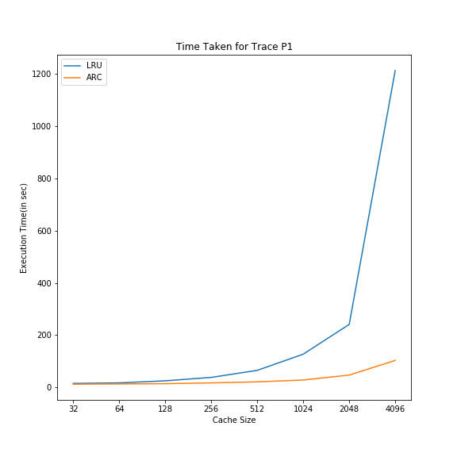

# ARC Cache

Цель проекта: реализация алгоритма ARC-кэширования на языке Си

## Оглавление

- [ARC кэш](#ARC-Cache)
  - [Описание](#описание)
  - [Установка](#установка)
  - [Структура проекта](#структура-проекта)
  - [Требования к среде](#требования-к-среде)
  - [Как использовать](#как-использовать)
  - [Тесты](#тесты)
- [Дополнительные материалы](#дополнительные-материалы)
- [Над проектом работали](#команда) 


## Описание

ARC (Adaptive Replacement Cache) - это алгоритм кэширования, используемый для эффективного управления кэшем данных.

В основе ARC лежит идея комбинирования двух алгоритмов кэширования - LRU (Least Recently Used) и LFU (Least Frequently Used). ARC делит кэш на два списка: список LRU и список LFU. Когда требуется заменить элемент в кэше, ARC анализирует попадания и промахи кэша и адаптивно решает, какой элемент следует заменить.

ARC использует два параметра: p и c. Параметр p отвечает за размер LRU-списка, а параметр c - за размер LFU-списка. Алгоритм автоматически адаптирует эти параметры в соответствии с изменениями в образце доступа к данным.

```markdown
1. (T1) содержит верхние или самые последние страницы в L1
2. (B1) содержит нижние или наименее новые страницы в L1
3. (T2) содержит верхние или самые последние страницы в L2
4. (B2) содержит нижние или наименее новые страницы в L2
```

## Структура проекта

- **list.cpp** Реализация двусвязного списка
- **hash.cpp**: Реализация хэш-таблицы
- **cash.cpp**: Главный файл, содержащий реализацию алгоритма.

В соответствующих папках hash_tests и list_tests содержатся тесты для проверки работоспособности двусвязного списка и хэш-таблицы

### Описание основных функций алгоритма ARC:

### 'init_cache'
```cpp
cache_ARC* init_cache(int size_of_cache);
```
Функция инициализирует кэш алгоритма ARC с заданным размером. Создает четыре пустых списка T1, T2, B1, B2 и хеш-таблицу для хранения кэша.

### 'ARC'

```cpp
void ARC(cache_ARC *ARC, long long int page);
```
Функция реализует алгоритм ARC для добавления страницы в кэш. Принимает указатель на кэш ARC и номер страницы page.

### 'replace'

```cpp
void replace(cache_ARC *arc, long long int page);
```
Функция реализует операцию замены в алгоритме ARC. Принимает указатель на кэш arc и номер страницы page.

### 'Вспомогательные функции'

```cpp
long long int min(long long int a, long long int b);
long long int max(long long int a, long long int b);
void free_cache(cache_ARC *cache);
```
Функции min и max возвращают минимальное и максимальное значение из двух переданных аргументов соответственно.  

Функция освобождает память, занятую кэшем алгоритма ARC, включая списки T1, T2, B1, B2 и хеш-таблицу.

## Требования к среде

Проект компилириуется на Windows и Linux на gcc --version: 13.1.0

## Как использовать

скачайте файлы cash.cpp, hash.cpp, list.cpp и соответствующие header-файлы.   

настройте makefile для запуска программы или
используйте компиляцию из командной строки в директории, где находится makefile 

```bash
make
``` 
и запустите файл cache.exe. 

## Зависимые объекты
GCC compilier, Makefile для сборки
//здесь будет код 

## Тесты
Убедитесь, что файлы находятся в одной директории и перейдите к соответствующему узлу cd, где хранятся файлы проекта

### Тесты хэш-таблицы: 
скачайте файлы из папки hash_tests: hash_test.cpp и hash_test.h  

и основные файлы hash.cpp и hash.h. Затем скомпилируйте совместно:  

```bash
g++ -o hash_program hash.cpp hash_tests.cpp
```
запустите исполняемый файл hash_programm.

файл generate_numbers создаёт текстовый файл numbers.txt c 10000 размером от 1 до 10000 для тестирования функций хэш-таблицы и производительности

_Тесты производительности хэш-таблицы:_

Time taken to add 1000000 elements: 0.110000 seconds  

Time taken to find 1000000 elements: 0.049000 seconds  

Time taken to delete 1000000 elements: 0.109000 seconds  


### Тесты двусвязного списка: 
скачайте файлы из папки list_tests и основные list.cpp, list.h  

запустите исполняемый файл list-test.cpp 

### Тесты производительности

 

# Дополнительные материалы:

Для более детального изучения вы можете ознакомиться с следующими материалами:

- [Статьи исследовательского центра IBM по алгоритму ARC](https://web.archive.org/web/20100329071954/http://www.almaden.ibm.com/StorageSystems/projects/arc/)
- [Статья на Википедии об алгоритме ARC](https://en.wikipedia.org/wiki/Adaptive_replacement_cache)
- [Видео 1](https://www.youtube.com/watch?v=_XDHPhdQHMQ)
- [Видео 2](https://www.youtube.com/watch?v=OJwaGdA8CU8)
- [Видео 3](https://www.youtube.com/watch?v=zWcgccpVRfA&t=277s)

# Команда:
- [@Popova Elizabeth](https://github.com/Ve-Po)
- [@Lobachev Alexander](https://github.com/qwerfiko)
- [@Shilov Artem](https://github.com/Asterialka)
- [@Novikova Polina](https://github.com/Novpolina)
